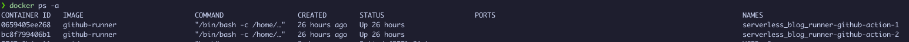

# Create Self-Hosted GitHub Action Runner using Docker

Github Self-hosted runner with Docker

Blame Google Translate and ChatGPT if you can't understand English in this file.

I can write it myself, but I'm lazy.

Keep it up!

## Prerequisites

1. Get a Personal Access Token (PAT) from GitHub
> Visit the [Settings](https://github.com/settings) page on GitHub.
>
> Select "Developer settings" from the left navigation.
>
> Choose "Personal access tokens" and click "Tokens (classic)."
>
> Name your token, select the `repo` and `workflow` scopes.
>
> Click "Generate token" at the bottom of the page.
>
> Immediately copy the generated token.
**Note: This token will only be shown once, copy and store it securely.**

You can ignore admin:org


2. Clone this repo
```bash
git clone https://github.com/viettdann/git-action-runner-docker.git
cd git-action-runner-docker
```
3. Prepare GitHub Repo Information
> Ensure you have created a repository on GitHub. For example: `viettdann/git-action-runner-docker`.
>
>Note the owner's name and the repository name:
>
>OWNER: viettdann
>
>REPO: git-action-runner-docker

## Build the Docker Images

```bash
docker buildx build --load --pull -t `docker_image_tag` .
```
Example:

```bash
docker buildx build --load --pull -t github_runner .
```

## Set Up the Runner

1. Rename development.env to .env
2. Edit .env file:
```dotenv
OWNER=owner
REPO=repo
ACCESS_TOKEN=git_access_token
RUNNER_NAME=name_the_runner
RUNNER_LABEL=name_the_runner_label
```
**Note**: The default RUNNER_LABEL comes with ubuntu:latest label, enabling GitHub workflows to run on a self-hosted runner without adjusting the run-on configuration.

3. Edit docker-compose.yml
```yaml
    deploy:
      mode: replicated
      replicas: 2
      restart_policy:
        condition: on-failure
```
Change number of docker replicate node

Remove
```yaml
volumes:
    - ./data/_work:/home/ubuntu/actions-runner/_work
```
If you don't want cache work folder on disk

Change if necessary
```yaml
network_mode: host
```

## Usage
```bash
docker compose up -d
```
Done!
Check your repository action runner.

## Screenshot




## Contributing

Pull requests are welcome. For major changes, please open an issue first
to discuss what you would like to change.

Please make sure to update tests as appropriate.

## License

I also rely on online post and copy from others, then adjust as needed, so feel free to copy.
I've referred to so many sources that I can't remember where they're from.

Regarding the Docker-compose and Dockerfile & dotenv, I wrote those myself.
